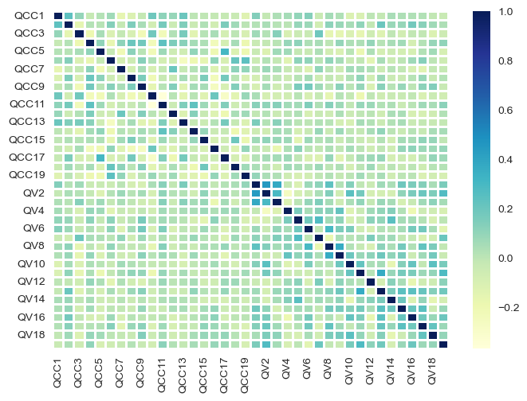
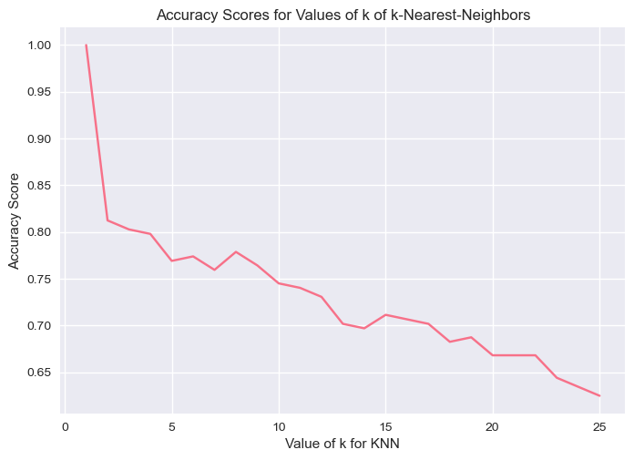
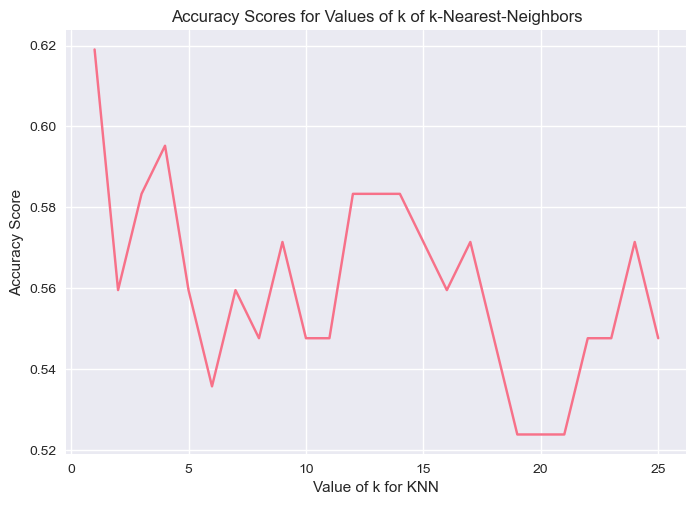

```python
import sys
sys.path.append('C:\\Python310\\Lib\\site-packages')
print (sys.path)
import numpy as np  # imports the `numpy` package and sets an alias
import math # imports built-in module math which provides access to mathematical functions
import matplotlib.pyplot as plt  # basic plotting library
import seaborn as sns # package for data visualisation written by [Michael Waskom](https://mwaskom.github.io/)
import pandas as pd
from scipy import stats
from datetime import datetime, timedelta  
import calendar
from matplotlib.patches import Patch
from matplotlib.lines import Line2D
# pd.set_option("display.notebook_repr_html", False)  # disable "rich" output
import sqlite3
import timeit
plt.style.use('seaborn')
from array import *


print ("pandas", pd.__version__ ) # FYI


conn = sqlite3.connect("/tmp/test5D.db")
# import sklearn
import sklearn
import scipy
from sklearn import metrics
from sklearn.neighbors import KNeighborsClassifier
from sklearn.linear_model import LogisticRegression
from sklearn.model_selection import train_test_split
print ("sklearn", sklearn.__version__ ) # FYI
print ("scipy", scipy.__version__ ) # FYI

sns.set_palette('husl')
import matplotlib.pyplot as plt
%matplotlib inline

import warnings
warnings.filterwarnings('ignore')
warnings.simplefilter('ignore')
```

    ['C:\\Users\\Julia', 'C:\\Users\\Julia\\anaconda3\\python39.zip', 'C:\\Users\\Julia\\anaconda3\\DLLs', 'C:\\Users\\Julia\\anaconda3\\lib', 'C:\\Users\\Julia\\anaconda3', '', 'C:\\Users\\Julia\\anaconda3\\lib\\site-packages', 'C:\\Users\\Julia\\anaconda3\\lib\\site-packages\\win32', 'C:\\Users\\Julia\\anaconda3\\lib\\site-packages\\win32\\lib', 'C:\\Users\\Julia\\anaconda3\\lib\\site-packages\\Pythonwin', 'C:\\Users\\Julia\\anaconda3\\lib\\site-packages\\IPython\\extensions', 'C:\\Users\\Julia\\.ipython', 'C:\\Python310\\Lib\\site-packages']
    pandas 1.4.4
    sklearn 1.0.2
    scipy 1.9.1
    

1.4.4 1.0.2 1.9.1


```python
# data = pd.read_csv("C:\Deakin\SIT764\MLAttemptCC_V.csv")
data = pd.read_csv("C:\Deakin\SIT764\MLAttemptCC_V_2.csv")
```


```python
data
```


<div>
<style scoped>
    .dataframe tbody tr th:only-of-type {
        vertical-align: middle;
    }

    .dataframe tbody tr th {
        vertical-align: top;
    }

    .dataframe thead th {
        text-align: right;
    }
</style>
<table border="1" class="dataframe">
  <thead>
    <tr style="text-align: right;">
      <th></th>
      <th>CC</th>
      <th>V</th>
      <th>QCC1</th>
      <th>QCC2</th>
      <th>QCC3</th>
      <th>QCC4</th>
      <th>QCC5</th>
      <th>QCC6</th>
      <th>QCC7</th>
      <th>QCC8</th>
      <th>...</th>
      <th>QV11</th>
      <th>QV12</th>
      <th>QV13</th>
      <th>QV14</th>
      <th>QV15</th>
      <th>QV16</th>
      <th>QV17</th>
      <th>QV18</th>
      <th>QV19</th>
      <th>Qualifier</th>
    </tr>
  </thead>
  <tbody>
    <tr>
      <th>0</th>
      <td>CCA</td>
      <td>A</td>
      <td>0</td>
      <td>0</td>
      <td>1</td>
      <td>1</td>
      <td>1</td>
      <td>1</td>
      <td>1</td>
      <td>1</td>
      <td>...</td>
      <td>0</td>
      <td>1</td>
      <td>0</td>
      <td>1</td>
      <td>0</td>
      <td>1</td>
      <td>0</td>
      <td>1</td>
      <td>0</td>
      <td>Poor</td>
    </tr>
    <tr>
      <th>1</th>
      <td>CCB</td>
      <td>B</td>
      <td>0</td>
      <td>0</td>
      <td>2</td>
      <td>1</td>
      <td>3</td>
      <td>1</td>
      <td>0</td>
      <td>2</td>
      <td>...</td>
      <td>0</td>
      <td>3</td>
      <td>1</td>
      <td>3</td>
      <td>0</td>
      <td>0</td>
      <td>2</td>
      <td>1</td>
      <td>2</td>
      <td>Good</td>
    </tr>
    <tr>
      <th>2</th>
      <td>CCC</td>
      <td>C</td>
      <td>2</td>
      <td>1</td>
      <td>2</td>
      <td>0</td>
      <td>1</td>
      <td>0</td>
      <td>1</td>
      <td>0</td>
      <td>...</td>
      <td>1</td>
      <td>1</td>
      <td>0</td>
      <td>1</td>
      <td>2</td>
      <td>1</td>
      <td>3</td>
      <td>2</td>
      <td>1</td>
      <td>Fair</td>
    </tr>
    <tr>
      <th>3</th>
      <td>CCD</td>
      <td>D</td>
      <td>2</td>
      <td>1</td>
      <td>2</td>
      <td>0</td>
      <td>0</td>
      <td>3</td>
      <td>2</td>
      <td>0</td>
      <td>...</td>
      <td>3</td>
      <td>2</td>
      <td>3</td>
      <td>3</td>
      <td>3</td>
      <td>3</td>
      <td>3</td>
      <td>1</td>
      <td>3</td>
      <td>Excellent</td>
    </tr>
    <tr>
      <th>4</th>
      <td>CCE</td>
      <td>E</td>
      <td>0</td>
      <td>0</td>
      <td>1</td>
      <td>0</td>
      <td>0</td>
      <td>2</td>
      <td>1</td>
      <td>0</td>
      <td>...</td>
      <td>1</td>
      <td>3</td>
      <td>0</td>
      <td>0</td>
      <td>0</td>
      <td>1</td>
      <td>1</td>
      <td>3</td>
      <td>3</td>
      <td>Excellent</td>
    </tr>
    <tr>
      <th>...</th>
      <td>...</td>
      <td>...</td>
      <td>...</td>
      <td>...</td>
      <td>...</td>
      <td>...</td>
      <td>...</td>
      <td>...</td>
      <td>...</td>
      <td>...</td>
      <td>...</td>
      <td>...</td>
      <td>...</td>
      <td>...</td>
      <td>...</td>
      <td>...</td>
      <td>...</td>
      <td>...</td>
      <td>...</td>
      <td>...</td>
      <td>...</td>
    </tr>
    <tr>
      <th>203</th>
      <td>CCHV</td>
      <td>HV</td>
      <td>1</td>
      <td>2</td>
      <td>1</td>
      <td>1</td>
      <td>1</td>
      <td>1</td>
      <td>2</td>
      <td>1</td>
      <td>...</td>
      <td>3</td>
      <td>3</td>
      <td>1</td>
      <td>3</td>
      <td>0</td>
      <td>0</td>
      <td>3</td>
      <td>3</td>
      <td>1</td>
      <td>Excellent</td>
    </tr>
    <tr>
      <th>204</th>
      <td>CCHW</td>
      <td>HW</td>
      <td>2</td>
      <td>1</td>
      <td>1</td>
      <td>0</td>
      <td>1</td>
      <td>1</td>
      <td>0</td>
      <td>0</td>
      <td>...</td>
      <td>3</td>
      <td>3</td>
      <td>1</td>
      <td>3</td>
      <td>0</td>
      <td>0</td>
      <td>2</td>
      <td>3</td>
      <td>2</td>
      <td>Excellent</td>
    </tr>
    <tr>
      <th>205</th>
      <td>CCHX</td>
      <td>HX</td>
      <td>2</td>
      <td>0</td>
      <td>0</td>
      <td>1</td>
      <td>0</td>
      <td>2</td>
      <td>0</td>
      <td>0</td>
      <td>...</td>
      <td>3</td>
      <td>2</td>
      <td>3</td>
      <td>2</td>
      <td>3</td>
      <td>0</td>
      <td>2</td>
      <td>2</td>
      <td>3</td>
      <td>Excellent</td>
    </tr>
    <tr>
      <th>206</th>
      <td>CCHY</td>
      <td>HY</td>
      <td>0</td>
      <td>0</td>
      <td>0</td>
      <td>1</td>
      <td>0</td>
      <td>1</td>
      <td>1</td>
      <td>1</td>
      <td>...</td>
      <td>3</td>
      <td>1</td>
      <td>3</td>
      <td>0</td>
      <td>0</td>
      <td>3</td>
      <td>0</td>
      <td>2</td>
      <td>3</td>
      <td>Excellent</td>
    </tr>
    <tr>
      <th>207</th>
      <td>CCHZ</td>
      <td>HZ</td>
      <td>0</td>
      <td>1</td>
      <td>0</td>
      <td>0</td>
      <td>0</td>
      <td>0</td>
      <td>0</td>
      <td>2</td>
      <td>...</td>
      <td>3</td>
      <td>2</td>
      <td>0</td>
      <td>3</td>
      <td>3</td>
      <td>2</td>
      <td>3</td>
      <td>0</td>
      <td>0</td>
      <td>Excellent</td>
    </tr>
  </tbody>
</table>
<p>208 rows × 41 columns</p>
</div>


```python
data.sample(10)
print (data.columns)
```


```python
sns.heatmap(data.corr(),cmap = "YlGnBu", linecolor = 'white', linewidths = 1, annot = False)
```


    <AxesSubplot:>


    

    


```python
print (data.describe())
print (data.columns)
```

                 QCC1        QCC2        QCC3        QCC4        QCC5        QCC6  \
    count  208.000000  208.000000  208.000000  208.000000  208.000000  208.000000   
    mean     0.995192    0.740385    1.230769    0.990385    0.701923    0.879808   
    std      0.945355    0.839774    1.028397    0.932455    0.936432    1.035587   
    min      0.000000    0.000000    0.000000    0.000000    0.000000    0.000000   
    25%      0.000000    0.000000    0.000000    0.000000    0.000000    0.000000   
    50%      1.000000    1.000000    1.000000    1.000000    0.000000    1.000000   
    75%      2.000000    1.000000    2.000000    2.000000    1.000000    1.250000   
    max      3.000000    3.000000    3.000000    3.000000    3.000000    3.000000   
    
                 QCC7        QCC8        QCC9       QCC10  ...        QV10  \
    count  208.000000  208.000000  208.000000  208.000000  ...  208.000000   
    mean     0.918269    0.706731    0.725962    0.899038  ...    1.519231   
    std      0.921065    0.965868    0.860793    1.113986  ...    1.167025   
    min      0.000000    0.000000    0.000000    0.000000  ...    0.000000   
    25%      0.000000    0.000000    0.000000    0.000000  ...    0.000000   
    50%      1.000000    0.000000    0.000000    0.000000  ...    2.000000   
    75%      2.000000    2.000000    1.000000    2.000000  ...    3.000000   
    max      3.000000    3.000000    3.000000    3.000000  ...    3.000000   
    
                 QV11        QV12        QV13        QV14        QV15        QV16  \
    count  208.000000  208.000000  208.000000  208.000000  208.000000  208.000000   
    mean     1.567308    2.048077    1.740385    1.942308    1.432692    1.706731   
    std      1.135841    0.936432    1.167144    1.079693    1.225844    1.127415   
    min      0.000000    0.000000    0.000000    0.000000    0.000000    0.000000   
    25%      0.000000    2.000000    1.000000    1.000000    0.000000    1.000000   
    50%      2.000000    2.000000    2.000000    2.000000    2.000000    2.000000   
    75%      3.000000    3.000000    3.000000    3.000000    3.000000    3.000000   
    max      3.000000    3.000000    3.000000    3.000000    3.000000    3.000000   
    
                 QV17        QV18        QV19  
    count  208.000000  208.000000  208.000000  
    mean     1.798077    1.735577    1.855769  
    std      1.119695    1.077788    1.080510  
    min      0.000000    0.000000    0.000000  
    25%      1.000000    1.000000    1.000000  
    50%      2.000000    2.000000    2.000000  
    75%      3.000000    3.000000    3.000000  
    max      3.000000    3.000000    3.000000  
    
    [8 rows x 38 columns]
    Index(['CC', 'V', 'QCC1', 'QCC2', 'QCC3', 'QCC4', 'QCC5', 'QCC6', 'QCC7',
           'QCC8', 'QCC9', 'QCC10', 'QCC11', 'QCC12', 'QCC13', 'QCC14', 'QCC15',
           'QCC16', 'QCC17', 'QCC18', 'QCC19', 'QV1', 'QV2', 'QV3', 'QV4', 'QV5',
           'QV6', 'QV7', 'QV8', 'QV9', 'QV10', 'QV11', 'QV12', 'QV13', 'QV14',
           'QV15', 'QV16', 'QV17', 'QV18', 'QV19', 'Qualifier'],
          dtype='object')
    


```python
X = data.drop(['CC','V'], axis=1)
g = sns.pairplot(X, hue='Qualifier', markers='+')
# # g = sns.pairplot(data, hue='Qualifier', markers='+')
plt.show()
```


    

    


```python
X = data.drop(['CC','V','Qualifier'], axis=1)
y = data['Qualifier']
# print(X.head())
print(X.shape)
# print(y.head())
print(y.shape)
```

    (208, 38)
    (208,)
    


```python
# experimenting with different n values

k_range = list(range(1,26))
scores = []
for k in k_range:
    knn = KNeighborsClassifier(n_neighbors=k)
    knn.fit(X, y)
    y_pred = knn.predict(X)
    scores.append(metrics.accuracy_score(y, y_pred))
    
plt.plot(k_range, scores)
plt.xlabel('Value of k for KNN')
plt.ylabel('Accuracy Score')
plt.title('Accuracy Scores for Values of k of k-Nearest-Neighbors')
plt.show()
```


    

    


```python
logreg = LogisticRegression(max_iter = 1000)
logreg.fit(X, y)
y_pred = logreg.predict(X)
print(metrics.accuracy_score(y, y_pred))
```

    0.9759615384615384
    

## Split the data into a training set and a testing set ##


```python
X_train, X_test, y_train, y_test = train_test_split(X, y, test_size=0.4, random_state=5)
print(X_train.shape)
print(y_train.shape)
print(X_test.shape)
print(y_test.shape)
```

    (124, 38)
    (124,)
    (84, 38)
    (84,)
    


```python
# experimenting with different n values
k_range = list(range(1,26))
scores = []
for k in k_range:
    knn = KNeighborsClassifier(n_neighbors=k)
    knn.fit(X_train, y_train)
    y_pred = knn.predict(X_test)
    scores.append(metrics.accuracy_score(y_test, y_pred))
    
plt.plot(k_range, scores)
plt.xlabel('Value of k for KNN')
plt.ylabel('Accuracy Score')
plt.title('Accuracy Scores for Values of k of k-Nearest-Neighbors')
plt.show()
```


    

    


```python
logreg = LogisticRegression(max_iter=3000)
logreg.fit(X_train, y_train)
y_pred = logreg.predict(X_test)
print(metrics.accuracy_score(y_test, y_pred))
```

    0.7023809523809523
    


```python
knn = KNeighborsClassifier(n_neighbors=12)
knn.fit(X, y)

# make a prediction for an example of an out-of-sample observation
knn.predict([[2,1,2,0,1,0,1,0,0,0,2,1,2,2,1,1,2,0,1,0,0,1,3,1,0,3,0,1,0,3,2,3,1,0,1,1,2,2]])
```


    array(['Fair'], dtype=object)


